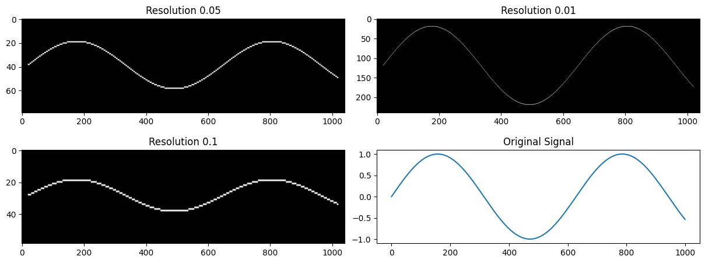
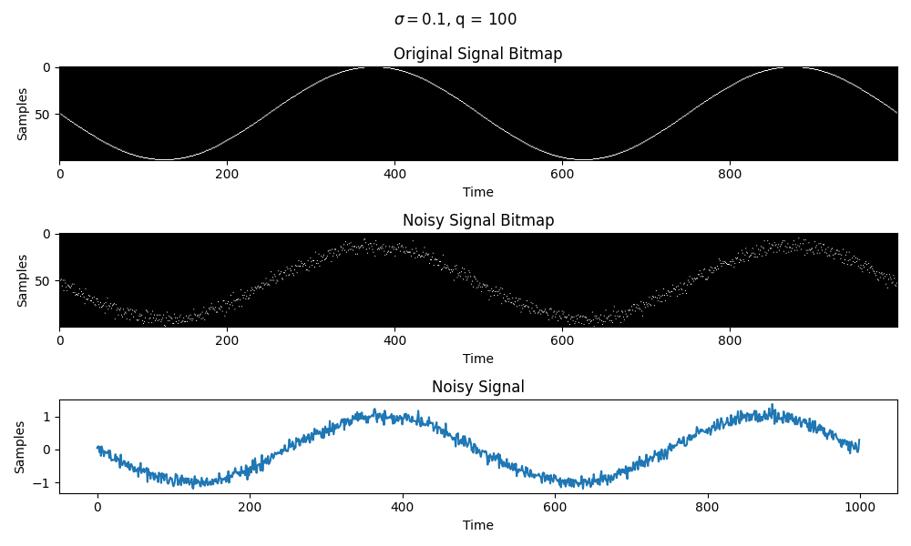
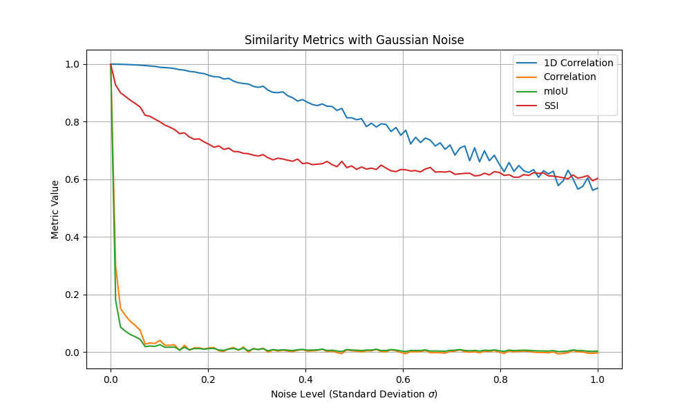
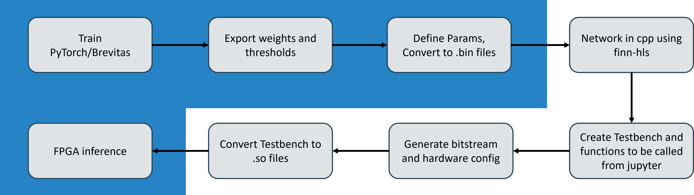
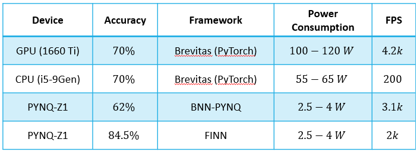
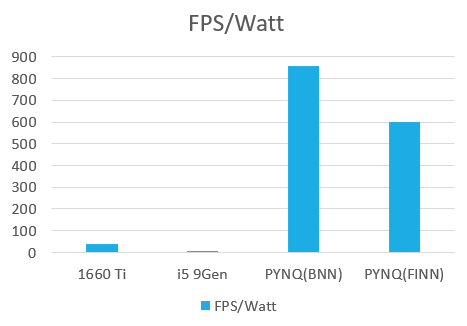
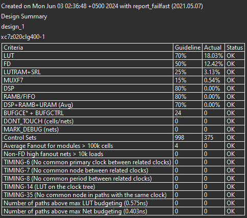
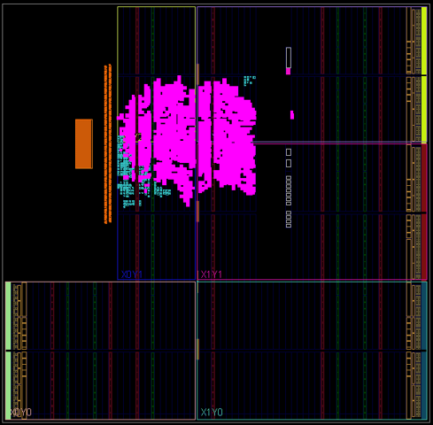

# 2D Signal processing

This project aims to explore a novel technique of 2D signal processing. The technique is based on the concept of 2D convolution and is used to process 2D signals.

($1 \times n$) 64-bit floating point 1D signal is converted into a <b>Sparse Binary</b> 2D signal by reshaping it into a 2D matrix of size $(m \times n)$ where $m$ is the number of quantization levels. The 2D signal is then processed using 2D convolution. This reduces the memory footprint and the hardware requirements for processing the signal.

We evaluate the performance of the proposed technique by comparing it with the traditional correlation based 1D signal processing. We pose a binary classification problem where the model has to differentiate between a noisy and original signal. The technique picking up the difference at low SNR levels is considered to be better.

## Results

Following figure shows the conversion of a 1D signal to a 2D bitmap. The 1D signal is a sine wave with added noise.

The following figure shows signal after adding different levels of noise. The noise added is gaussian white noise with a standard deviation of $\sigma$.

The following figure shows different similarity indices for the noisy and original signal. The similarity indices are calculated using the correlation and convolution techniques.

mIoU and 2D correlation drop very sharply as the noise level increases but this level of noise is very common in signals hence it is too sensitive and not useful.

1D correlation shows a linear drop in the similarity as the standard deviation of the noise increases. The drop is linear and hence it is not sensitive enough to differentiate between the noisy and original signal.

However, SSI (structural similarity index) shows a non-linear drop in the similarity as the standard deviation of the noise increases. The response is a decaying exponential settling at a normalized value of about 0.6. This makes it a good candidate for differentiating between the noisy and original signal as it is sensitive enough to pick up the difference at low SNR levels and also robust enough to not get affected by high SNR levels.

## FPGA Implementation

Afterwards, a synthetic dataset was trained for noisy and original signals. The dataset was trained using a CNN model as outlined in the `model.py` file.

Following the workflow outlined in the diagram below, the model is deployed on FPGA using the FINN HLS library.

The main advantage of deploying the model on FPGA is the reduction in latency and power consumption. The model is deployed on the PYNQ-Z1 board and the results are shown below.

A graph shows better representation of the power consumption and latency of the model on FPGA as compared to the CPU and GPU.

Following synthesis results were obtained for the model on FPGA.

